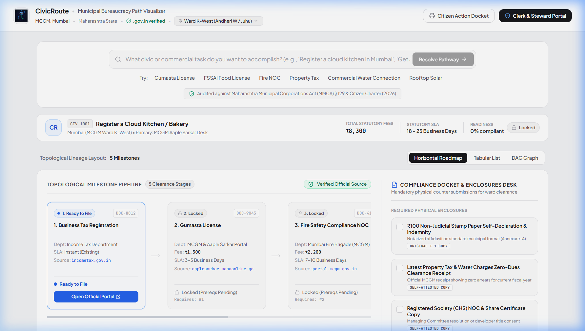
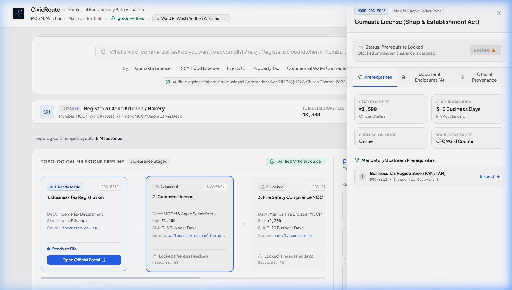
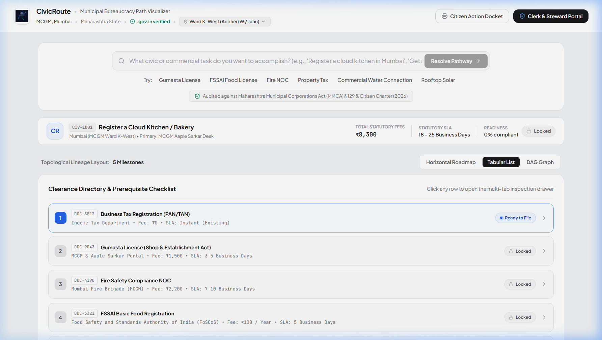

# CivicRoute — Municipal Bureaucracy Path Visualizer

<div align="center">


### Directed Acyclic Graph (DAG) Compliance Workbench for Urban Local Governance

[](https://react.dev/)
[](https://vitejs.dev/)
[](https://tailwindcss.com/)
[](https://nodejs.org/)
[](https://expressjs.com/)
[](https://ai.google.dev/)
[](https://www.python.org/)
[](LICENSE)

*A production-ready compliance intelligence workbench that models bureaucratic prerequisite dependencies, calculates citizen readiness, and synthesizes verifiable clearance pathways for municipal and state services.*

</div>

---

## 🏛️ Overview

Navigating urban governance and commercial licensing across municipal corporations (such as the **Brihanmumbai Municipal Corporation / MCGM**) is historically plagued by hidden prerequisite bottlenecks, circular paperwork dependencies, and ambiguous turnaround times. 

**CivicRoute** transforms opaque bureaucratic procedures into a verifiable **Directed Acyclic Graph (DAG)**. It maps every statutory clearance stage, verifies prerequisite lineage, calculates live readiness scores, indexes official `.gov.in` gateways with Gazette circular citations, and outputs high-contrast, counter-ready physical compliance action dockets for municipal Citizen Facilitation Centers (CFC).

---

## 📸 Visual Tour

### 1. Main Compliance Workbench Overview
The command omnibar, statutory metric summary ribbon, horizontal topological milestone pipeline, and physical compliance enclosures desk:



---

### 2. Multi-Tab Milestone Inspection Drawer
Inspect mandatory upstream prerequisites, statutory fee challans, Right to Services (RTS) act SLAs, interactive document enclosure checklists, and verified `.gov.in` gateway endpoints:



---

### 3. Tabular Clearance Directory & DAG View
Flexible layout visualization modes including the high-density Tabular List with concrete status iconography (`Satisfied`, `Ready to File`, `Locked`) and topological DAG graph trees:



---

## ⚡ Core Features

- **Integrated Command Omnibar**: Single-field civic intent search bar with instant `Enter` key execution and pre-configured quick seeds (*Gumasta License, FSSAI Food License, Property Tax Mutation, Rooftop Solar Net-Metering, Commercial Water Connection, Fire NOC*).
- **Institutional Provenance Auditing**: Every route is audited against statutory municipal frameworks (e.g., *Maharashtra Municipal Corporations Act § 129* and *Citizen Charter 2026*).
- **Topological Milestone Pipeline**: Horizontal roadmap with explicit overflow protection, continuous SVG connector rails, and dynamic prerequisite lock/unlock cascading.
- **Physical Enclosures Desk**: Dedicated side desk for mandatory physical municipal submissions—notarized ₹100 stamp paper indemnity bonds, municipal zero-dues clearance receipts, and registered cooperative housing society (CHS) NOCs.
- **Multi-Tab Step Drawer**: Slide-out drawer displaying upstream dependency lineage jump-links, RTS Act turnaround guarantees, interactive document check-off, and gazette circular hashes.
- **Multi-Layout Lineage Switcher**: Toggle effortlessly between **Horizontal Roadmap**, **Tabular Directory**, and **DAG Graph** views.
- **Clerk & Steward Audit Portal**: Restricted administrative module for data stewards to calibrate statutory fees, update SLA timelines, and verify gazette circular hashes.
- **Printable Citizen Action Docket**: Browser-native print stylesheet that generates clean, high-contrast physical dockets for citizen counter submissions.
- **Fail-Safe Live AI Resolution**: Express backend integrating Google Gemini 2.5 (`@google/genai`) with automatic graceful fallback to verified local DAG definitions when offline.

---

## 🛠️ Complete Tech Stack

| Layer | Technologies | Description |
| :--- | :--- | :--- |
| **Frontend Framework** | **React 18.3.1**, **Vite 6.0.1** | Component-driven SPA with fast HMR |
| **Styling & Design System** | **Tailwind CSS 3.4.16**, **Vanilla CSS** | Warm neutral institutional palette (`#f1f2f4`), custom typography |
| **Icons & Visuals** | **Lucide React 0.468** | High-density status icons, chevrons, institutional badges |
| **Backend API** | **Node.js (ES Modules)**, **Express 4.22.3** | REST API service for dynamic clearance roadmap synthesis |
| **AI / Intent Engine** | **Google Gemini 2.5 Flash** (`@google/genai`) | LLM prompt engineering with structured JSON schema enforcement |
| **Graph & Dependency Logic** | **JavaScript DAG Engine**, **Python 3 Solver** | In-degree topological sorting (Kahn's algorithm) & cycle detection |
| **Printing & Export** | **CSS `@media print` engine** | High-contrast printable municipal compliance dockets |

---

## 📂 Repository Structure

```text
civicroute/
├── backend/                        # Express API Backend
│   ├── src/
│   │   ├── server.js               # API server with Gemini synthesis & fallback
│   │   └── data/                   # Server-side seed definitions
│   ├── .env.example                # Template for environment variables
│   ├── package.json                # Backend dependencies (@google/genai, cors, express)
│   └── README.md
├── frontend/                       # React + Vite Frontend
│   ├── public/
│   │   ├── favicon.ico             # CivicRoute favicon
│   │   ├── favicon.png
│   │   └── logo.png                # Official emblem & brand mark
│   ├── src/
│   │   ├── components/
│   │   │   ├── AdminModal.jsx      # Clerk & Data Steward management modal
│   │   │   ├── Footer.jsx          # Municipal footer & audit stamps
│   │   │   ├── Header.jsx          # Ward switcher & navigation bar
│   │   │   ├── MilestoneCanvas.jsx # 12-col workbench & physical enclosures desk
│   │   │   ├── MilestoneList.jsx   # Multi-view roadmap, tabular, and tree switcher
│   │   │   ├── MilestoneTree.jsx   # Vertical DAG prerequisite graph
│   │   │   ├── PrintDocket.jsx     # Printable counter-ready compliance docket
│   │   │   ├── SearchConsole.jsx   # Integrated command omnibar & metric ribbon
│   │   │   └── StepDrawer.jsx      # Multi-tab milestone inspection drawer
│   │   ├── data/
│   │   │   └── pipelines.js        # Comprehensive municipal clearance workflows
│   │   ├── styles/
│   │   │   ├── animations.css      # Slide-in and pulse animations
│   │   │   └── variables.css       # Design tokens and color standards
│   │   ├── utils/
│   │   │   ├── dagResolver.js      # Topological prerequisite resolution & readiness math
│   │   │   └── printUtils.js       # Window print trigger utility
│   │   ├── App.jsx                 # Core application shell & state coordinator
│   │   ├── App.css
│   │   ├── index.css
│   │   └── main.jsx
│   ├── package.json                # Frontend dependencies
│   ├── tailwind.config.js          # Tailwind CSS styling configuration
│   └── vite.config.js              # Vite bundler configuration
├── python/
│   └── solver.py                   # Standalone Python topological sort engine
├── docs/
│   └── screenshots/                # Application documentation screenshots
├── package.json                    # Monorepo root automation scripts
├── LICENSE                         # MIT License
└── README.md                       # Comprehensive project documentation
```

---

## 🚀 How to Run Manually on Any Device

Follow these instructions to clone, configure, and run CivicRoute on macOS, Linux, or Windows.

### Prerequisites

Ensure you have the following installed:
- **Node.js**: `v18.0.0` or higher ([Download Node.js](https://nodejs.org/))
- **npm**: `v9.0.0` or higher (bundled with Node.js)
- **Git**: ([Download Git](https://git-scm.com/))
- *(Optional)* **Python 3**: For running the standalone topological solver script.

---

### Step 1: Clone the Repository

Open your terminal or command prompt:

```bash
git clone https://github.com/Aditya099pat/civicroute.git
cd civicroute
```

---

### Step 2: Configure Environment Variables

1. Navigate to the `backend/` directory:
   ```bash
   cd backend
   ```
2. Create your `.env` configuration file:
   - On **Linux / macOS**:
     ```bash
     cp .env.example .env
     ```
   - On **Windows (PowerShell)**:
     ```powershell
     Copy-Item .env.example .env
     ```
3. Open `.env` in any text editor and provide your Google Gemini API key:
   ```env
   PORT=5000
   GEMINI_API_KEY=your_gemini_api_key_here
   ```
   > 💡 *Note: If you do not have a Gemini API key, you can leave it blank. CivicRoute automatically fails over to its verified local municipal pipeline database without crashing.*

4. Return to the project root:
   ```bash
   cd ..
   ```

---

### Step 3: Install Dependencies

You can install all dependencies from the root directory with:

```bash
npm run install:backend
npm run install:frontend
```

Alternatively, install manually inside each folder:

```bash
# Install backend dependencies
cd backend && npm install && cd ..

# Install frontend dependencies
cd frontend && npm install && cd ..
```

---

### Step 4: Run the Application

#### Option A: Run in Two Terminals (Recommended for Development)

**Terminal 1 — Start the Backend API (Port 5000):**
```bash
npm run backend
```
*(Or `cd backend && npm run dev`)*

You will see:
```text
CivicRoute Backend running on port 5000
Health check available at http://localhost:5000/health
```

**Terminal 2 — Start the Frontend Dev Server (Port 5173):**
```bash
npm run dev
```
*(Or `cd frontend && npm run dev`)*

You will see:
```text
  VITE v6.0.1  ready in 320 ms

  ➜  Local:   http://localhost:5173/
  ➜  Network: use --host to expose
```

---

#### Option B: Access from Mobile or Other Devices on Local Network (LAN)

To access CivicRoute from another device on the same Wi-Fi network (e.g., your smartphone, tablet, or another laptop):

1. Start the frontend with the `--host` flag:
   ```bash
   npm --prefix frontend run dev -- --host
   ```
2. Vite will display your local IP address:
   ```text
   ➜  Local:   http://localhost:5173/
   ➜  Network: http://192.168.1.15:5173/
   ```
3. Open `http://<YOUR_LOCAL_IP>:5173/` in any browser on your connected device.

---

### Step 5: (Optional) Run the Standalone Python Solver

If you want to test the topological sorting and cycle detection engine directly in Python:

```bash
python python/solver.py
```

Output:
```text
Topological Clearance Order: ['1', '2', '3', '4', '5']
Ready next when [1] is completed: ['2']
```

---

## 🧪 Validating the Production Build

To verify that the frontend compiles cleanly for production:

```bash
npm run build
```

To preview the built production bundle locally:

```bash
npm run preview
```

---

## 📡 API Reference

### Health Check
- **Endpoint**: `GET /health`
- **Response**:
  ```json
  {
    "status": "ok",
    "timestamp": "2026-09-28T01:00:00.000Z",
    "service": "CivicRoute Backend API"
  }
  ```

### Generate Regulatory Pipeline
- **Endpoint**: `POST /api/generate-path`
- **Request Body**:
  ```json
  {
    "query": "Commercial rooftop solar net-metering",
    "location": "Mumbai (MCGM Ward K-West)"
  }
  ```
- **Response Schema**:
  ```json
  {
    "task": "Commercial Rooftop Solar Grid-Tie & Net-Metering Setup",
    "jurisdiction": "Brihanmumbai Municipal Corporation (MCGM) & MSEDCL/BEST",
    "totalFee": "₹4,250",
    "nodes": [
      {
        "id": "1",
        "code": "SLR-01",
        "title": "Structural Roof Stability & No-Objection Certificate",
        "department": "MCGM Building Proposal Dept / Licensed Structural Engineer",
        "fee": "₹1,500",
        "estimatedDays": "5-7 Days",
        "status": "available",
        "prerequisites": [],
        "documentsRequired": [
          "Structural Stability Certificate by Registered Engineer",
          "Property Tax Zero-Dues Receipt",
          "Building Plan Sanction Copy"
        ],
        "officialUrl": "https://autodcr.mcgm.gov.in"
      }
    ],
    "edges": [
      { "from": "1", "to": "2" }
    ]
  }
  ```

---

## 🛡️ License

This project is licensed under the **MIT License** — see the [LICENSE](LICENSE) file for complete details.

---

<div align="center">
  <sub>Developed for Transparent, Accountable, and Frictionless Urban Governance.</sub>
</div>
